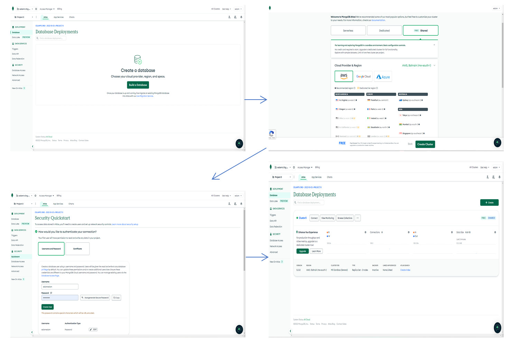
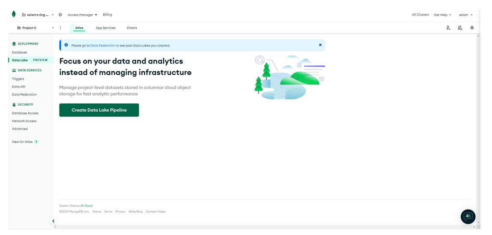
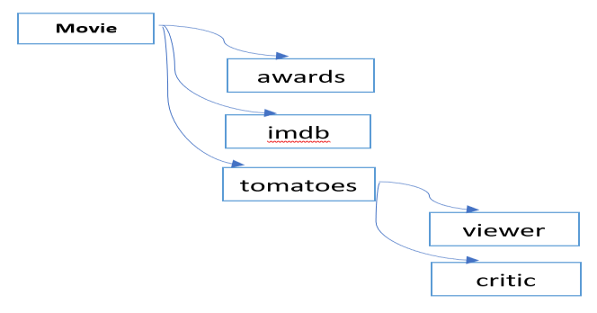
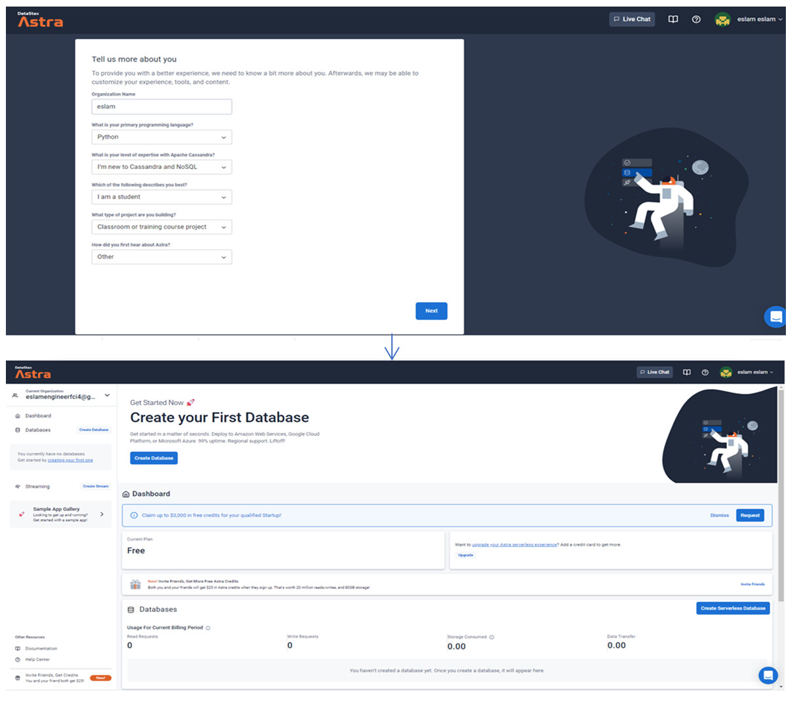
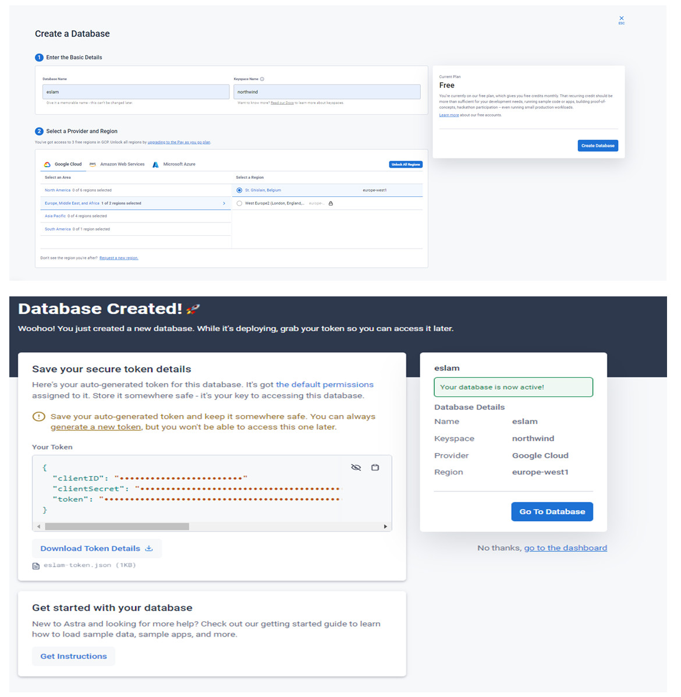
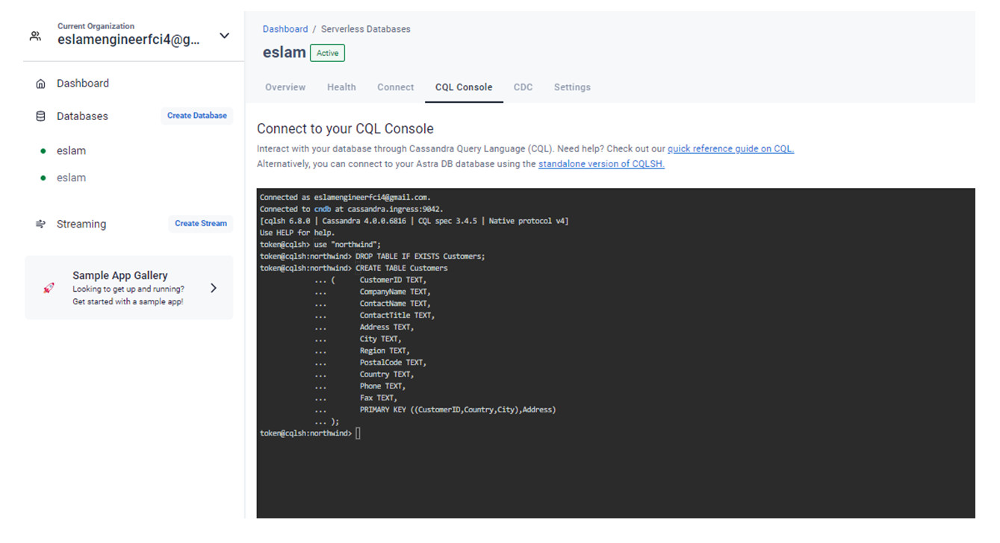
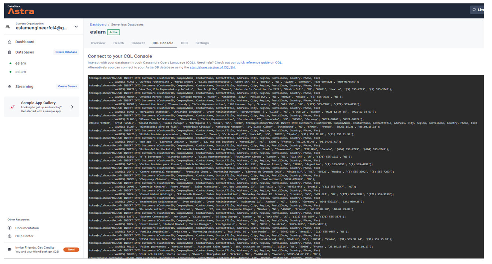
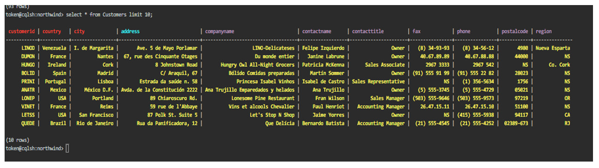
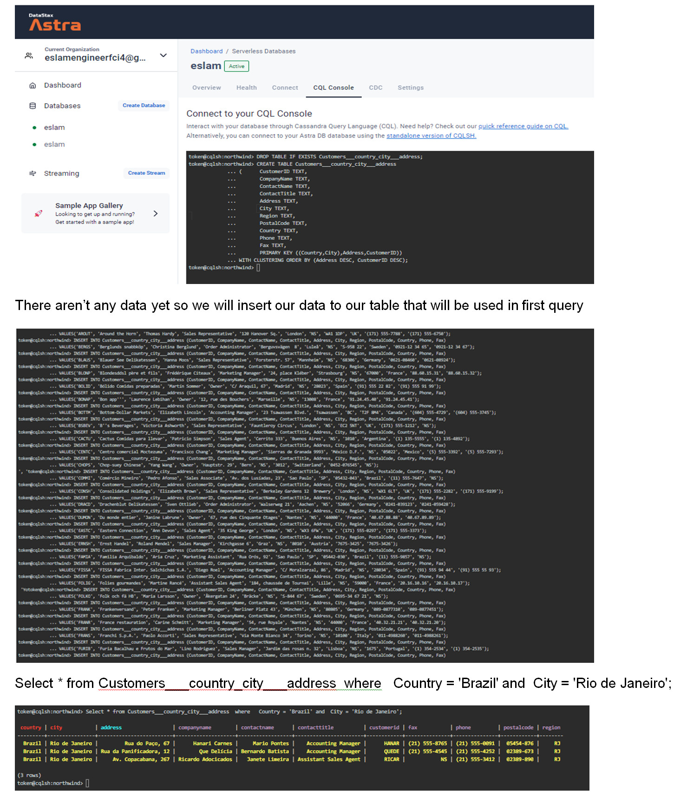

# Using MongoDB and Cassandra in analysis for both the movies' database and the Sales Manager database

## Using MongoDB for analysis the movies' database:

### Before using MongoDb, Set an account on MongoDB Atlas: (https://cloud.mongodb.com) as shown in the following figure:

 
### Load the Sample Netflix Movies Database to your Data Lake:

After loading Sample Netflix Movies Database, we noticed documents contain the following attributes, but these attributes not found in all documents but these attributes we noticed them by showing some documents in our database:
This is the data model for our document that represents that the movie document has many (awards, imdb, tomatoes) and each tomatoes has many (viewer, critic) as shown in the following figure:

-  “_id” with type “ObjectId” that represent the document ID of each document
- “plot” with type “String”
- “genres” with type “Array”
- “runtime” with type “Integer”
- “cast” with type “Array”
- “num_mflix_comments” with type “Integer”
- “poster” with type “String”
- “title” with type “String”
- “fullplot” with type “String”
- “languages” with type “Array”
- “released” with type “Timestamp”
- “directors” with type “Array”
- “rated” with type “String”
- “awards” with type “Object” that object contain the following (“wins” with type “Integer”, “nominations” with type
“Integer” and “text” with type “String”)
- “lastupdated” with type “String”
- “year” with type “Integer”
- “imdb” with type “Object” that object contain the following (“rating” with type “Double”, “votes” with type “Integer” and ” id” with type “Integer” )
- “countries” with type “Array”
- “type” with type “String”

- “tomatoes” with type “Object” that object contain the following (“viewer” with type “Object” that object contain the following (“rating” with type “Double”, “numReviews” with type “Integer” and “meter” with type “Integer”)
“critic” with type “Object” that object contain the following (“rating” with type “Double”, “numReviews” with type “Integer” and “meter” with type “Integer”) “rotten” with type “Integer” and “fresh” with type “Integer” and
“dvd” with type “Timestamp” and “lastUpdated” with type “Timestamp”). 

All of this represents each document in Netflix Movies Database.
. . . . 
Others...... 

## Using DataStax Astra Cassandra-as-a-Service for analysis in the Sales Manager database.

### Before using Cassandra, Set an account on Cassandra Atlas:(https://astra.datastax.com/)  as shown in the following figures:

### Create the customer tables (attached SQLite definition will serve as a guide) Review the questions in the queries section below and create one or more tables that partition and clusters data so these queries will execute without using Cassandra “ALLOW FILTERING” that scans all partitions as shown in figure:

### Load the attached data into your table(s) using the insert statements (minor modifications may be needed if your definitions include multiple tables). Please include screens counts after loading your data:

### Select * from Customers limit 10; (show 10 records from customers table)

### Queries:
1. Provide the query and the results (screenshots and a copy of your query) that show the customers from Rio de Janeiro, Brazil ordered by their addresses. 
2. Provide a list of customers that are in the Sales Manager role without forcing the scan of all partitions across all databases. The result should be ordered by their names.
3. 

- Solution:
1. Our first table is Customers___country_city___address that represent our first query. In our first table we used (country, city) as partition keys and (address, customerId) as cluster keys because these four values will make a unique value for each record.

2. Our second table is Customers___contactname___contacttitle that represent our second query and insert data to it
In our second table we used (ContactTitle) as partition key and (ContactName, Phone) as cluster keys because these three values will make a unique value for each record

